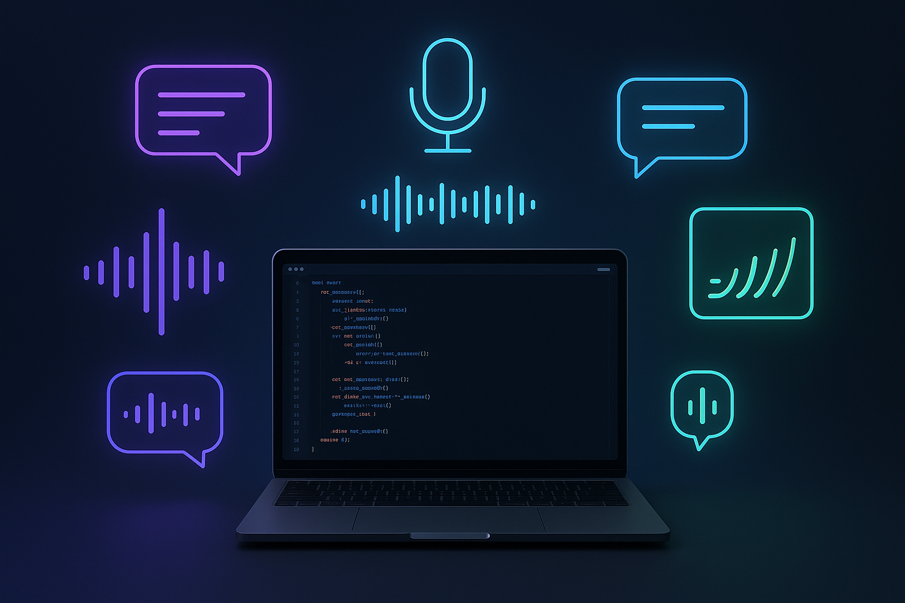

# ElevenLabs Development Workspace



<p align="center">
  A comprehensive development workspace for building AI-powered voice applications with ElevenLabs and OpenAI APIs
</p>

## 🎯 Overview

This workspace contains multiple projects and comprehensive API documentation for building advanced voice AI applications. It includes both practical implementations and detailed reference materials for ElevenLabs and OpenAI APIs.

## 📁 Project Structure

```
elevenlabs/
├── 🗂️ APIDOCS/                    # Comprehensive API documentation
│   ├── elevenlabs/                # ElevenLabs API guides and examples
│   │   ├── createspeechtimestamps.md
│   │   ├── prompting.md
│   │   ├── streamingtext2speech.md
│   │   └── text2dialogue.md
│   └── openai/                    # OpenAI API documentation
│       ├── AudioandSpeech.md
│       ├── FunctionCalling.md
│       ├── Realtime/
│       └── TextGeneration.md
├── 🚀 motivate-me-app/            # AI motivational speech generator
└── 🛠️ elevenlabs-nextjs-example/  # Next.js starter kit with examples
```

## 🎨 Featured Projects

### 1. Motivate Me App
An AI-powered motivational speech generator that creates personalized speeches with synchronized audio and visual highlighting.

**Key Features:**
- 🤖 AI speech generation using OpenAI GPT-4
- 🎵 ElevenLabs V3 audio synthesis with character-level timestamps
- ✨ Real-time text highlighting synchronized with audio
- 🎶 Smart background music selection based on speech mood
- 📱 Responsive design for all devices

### 2. ElevenLabs Next.js Starter Kit
A comprehensive starter kit showcasing ElevenLabs capabilities in a modern Next.js application.

**Capabilities:**
- 🗣️ Text to Speech with advanced voice controls
- 👂 Speech to Text with speaker diarization
- 🎵 Sound Effects generation
- 🤖 Conversational AI integration

## 🚀 Quick Start

### Prerequisites
- Node.js 18+ and pnpm
- OpenAI API key ([Get one here](https://platform.openai.com/api-keys))
- ElevenLabs API key ([Get one here](https://elevenlabs.io/app/settings/api-keys))

### Choose Your Project

#### Option 1: Motivate Me App
```bash
cd motivate-me-app
pnpm install
cp env.example .env
# Add your API keys to .env
pnpm dev
```

#### Option 2: ElevenLabs Next.js Examples
```bash
cd elevenlabs-nextjs-example
pnpm install
cp .env.example .env
# Add your API keys to .env
pnpm dev
```

Open [http://localhost:3000](http://localhost:3000) in your browser.

## 📚 API Documentation

This workspace includes comprehensive documentation for both ElevenLabs and OpenAI APIs:

### ElevenLabs APIs
- **Text to Speech**: Convert text to lifelike audio with V3 emotional tags
- **Speech with Timestamps**: Character-level timing for synchronization
- **Text to Dialogue**: Multi-speaker conversations
- **Streaming Audio**: Real-time audio generation

### OpenAI APIs
- **Text Generation**: GPT models for content creation
- **Function Calling**: Extend AI capabilities with custom functions
- **Realtime API**: Low-latency voice interactions
- **Structured Outputs**: Guaranteed JSON schema compliance

## 🛠️ Technology Stack

- **Frontend**: Next.js 15 with TypeScript
- **Styling**: Tailwind CSS + Radix UI components
- **AI APIs**: 
  - OpenAI GPT-4/GPT-5 for text generation
  - ElevenLabs V3 for audio synthesis
- **Audio**: Advanced audio processing and synchronization
- **State Management**: React hooks and context

## 🎯 Use Cases

This workspace enables you to build:

- 🎙️ **Voice Assistants**: Conversational AI with natural speech
- 📖 **Audio Content**: Podcasts, audiobooks, and narration
- 🎮 **Interactive Media**: Games with dynamic voice generation
- 📚 **Educational Tools**: Learning apps with speech synthesis
- 🎬 **Content Creation**: Video narration and sound effects
- 💬 **Communication**: Real-time voice chat applications

## 🔧 Configuration

### Environment Variables
Create a `.env` file in your chosen project directory:

```env
# OpenAI Configuration
OPENAI_API_KEY=your_openai_api_key
OPENAI_MODEL=gpt-4o

# ElevenLabs Configuration  
ELEVENLABS_API_KEY=your_elevenlabs_api_key
ELEVENLABS_MODEL=eleven_flash_v2_5
ELEVENLABS_VOICE_ID=TX3LPaxmHKxFdv7VOQHJ

# Application Configuration
NEXT_PUBLIC_APP_URL=http://localhost:3000
```

### Model Recommendations
- **ElevenLabs**: `eleven_flash_v2_5` for fast, high-quality speech
- **OpenAI**: `gpt-4o` for intelligent text generation
- **Voice**: Use the provided voice IDs or explore the voice library

## 📖 Learning Resources

### API Guides
- [ElevenLabs V3 Prompting Guide](APIDOCS/elevenlabs/prompting.md)
- [OpenAI Function Calling](APIDOCS/openai/FunctionCalling.md)
- [Realtime API Documentation](APIDOCS/openai/Realtime/)
- [Speech with Timestamps](APIDOCS/elevenlabs/createspeechtimestamps.md)

### Example Implementations
- Explore the `motivate-me-app` for advanced audio synchronization
- Check `elevenlabs-nextjs-example` for comprehensive API usage
- Review the APIDOCS for detailed implementation guides

## 🤝 Contributing

1. Fork the repository
2. Create a feature branch
3. Make your changes
4. Test thoroughly
5. Submit a pull request

## 📄 License

This project is licensed under the MIT License - see the individual project LICENSE files for details.

## 🔗 Links

- [ElevenLabs Platform](https://elevenlabs.io)
- [ElevenLabs Documentation](https://elevenlabs.io/docs)
- [OpenAI Platform](https://platform.openai.com)
- [Next.js Documentation](https://nextjs.org/docs)

---

<p align="center">
  Built with ❤️ using ElevenLabs and OpenAI APIs
</p>
